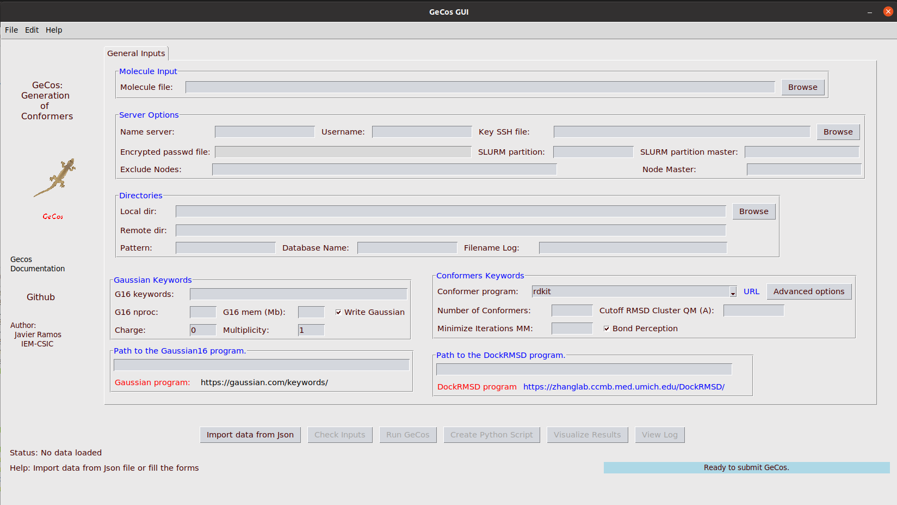

Installation guide
==============

**``Gecos``** toolkit is implemented in Python. This toolkit have some dependencies from other python packages such as:

*  [MDAnalysis](https://www.mdanalysis.org/) 
* [Rdkit](https://www.rdkit.org/) 
* [Indigox](https://github.com/allison-group/indigox) 
* [Openbabel](http://openbabel.org/wiki/Main_Page)
(...)

The full list of dependencies can be followed from both **[requirements.txt](../requirements.txt)** and **[setup.py](../setup.py)** files.

These dependencies are handled by the **setup.py** script and they should be installed automatically following these steps. Anyway, few software need to be installed manually (see Pre-installation section)

-------------------
#### Pre-installation
-------------------
Previous to install the program  some software need to be installed in your system. Installation of the software using the Ubuntu package repository is given between parentheses, for other distributions please check their documentations.

* `git` (sudo apt-get install git)
* `python3-venv` (sudo apt update; sudo apt-get install python3-venv)
* `python3-dev` (sudo apt-get install python3-dev python-dev)
* `python3-tk` (sudo apt-get install python3-tk)
* `swig` (sudo apt-get install swig)

-------------------
#### Create a virtualenv environment 
-------------------
It is highly recommended to create a virtual environment. This is a Python environment such that the Python interpreter, libraries and scripts installed into it are isolated from those installed in other virtual environments, and (by default) any libraries installed in a “system” Python.

First, we create an isolated Python environment to install the required packages (see dependencies below). Then, activate the virtual environment.

```bash
$ python3 -m venv <name_of_env>
$ source <name_of_env>/bin/activate
$ pip list
$ pip install --upgrade pip
```

**``WARNING:``** This virtual environment **must** be activate in order to use the program.

Example:

```bash
ubuntu@ubuntu2004:~$ python3 -m venv sandbox_gecos
ubuntu@ubuntu2004:~$ source sandbox_gecos/bin/activate
(sandbox_gecos) ubuntu@ubuntu2004:~$ pip list
Package       Version
------------- -------
pip           22.0.4
pkg_resources 0.0.0
setuptools    44.0.0
(sandbox_gecos) ubuntu@ubuntu2004:~$
(sandbox_gecos) ubuntu@ubuntu2004:~$ deactivate
ubuntu@ubuntu2004:~$ 
```
Note that the python environment is activated, (sandbox_gecos) before the linux prompt. The environment can be deactivate using the **deactivate** command.

-------------------
#### Clone the github repository and install Gecos
-------------------
With the python virtual environment activated, clone and install requested python libraries
```bash
git clone https://github.com/jrdcasa/gecos.git
cd gecos
python -m pip install wheel
python setup.py install 
```

If installation is correct you should see the following message:
```
(...)
Installed /home/ubuntu/sandbox_gecos/lib/python3.8/site-packages/gecos-0.1-py3.8.egg
Processing dependencies for gecos==0.1
Finished processing dependencies for gecos==0.1

		 Installation Done!!!! at 16/03/2022 11:09:06
```
An **install.log** file has been generated with information about the installation process

-------------------
#### Run Gecos
-------------------
You can run GeCos using the command line as:
```
(sandbox_gecos) ubuntu@ubuntu2004:~/gecos$ gecos
usage: gecos [-h] (-j JSON_FILE | -p PYTHON_FILE)
gecos: error: one of the arguments -j/--json -p/--python is required
(sandbox_gecos) ubuntu@ubuntu2004:~/gecos$ 
```

Also, a GUI can be used to run GeCos:
```
(sandbox_gecos) ubuntu@ubuntu2004:~/gecos$ gecos_gui
```

<p align="center">
    
</p>
