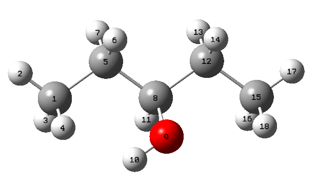

Setup GeCos with the Graphical User Interface (GUI)
==============

---------------------------
#### Preparation of the initial structure
---------------------------

In this example, **ethylene vynyl alcohol** (EVOH) oligomers will be generated by  [GeCoS](https://github.com/jrdcasa/gecos). The monomer for this oligomer is shown in Figure 1. 


<p>
    
    <p style="margin-left:18em;font-size: 18px;font-weight:bold">Figure 1: Chemical structure used in this calculation</p>
</p>


The initial structure for the EVOH model has been built using Gaussview. Two files were prepared,  a [pdb](files/Model01_EVOH.pdb) and the input file for [gaussian](files/Model01_EVOH.gjf). After this, the structure has been optimized at M062X/6-31G** level ([J.Comp.Chem 2013, 34(2), 121-31](https://onlinelibrary.wiley.com/doi/10.1002/jcc.23112)). Calculation is run in a cluster with Gaussian16.

Table 1 contains the files from the optimization process.

| System | Gaussian input | Gaussian output   | Optimized PDB |
|---|---|---|---|
|  Model01_EVOH |   [gaussian input](files/Model01_EVOH.gjf) |   [gaussian log](files/Model01_EVOH.log)|   [gaussian opt](files/Model01_EVOH_opt.pdb)| 


---------------------------
#### Setup GeCos calculation
---------------------------

Open the GUI for Gecos:

```
ubuntu@ubuntu2004:~$ source sandbox_gecos/bin/activate
(sandbox_gecos) ubuntu@ubuntu2004:~/gecos$ gecos_gui
```

<p align="center">
    
</p>

1. Browse for your directory an find the optimized pdb for the EVOH model and add to the Molecule file field.
2. Now, we need to setup all fields relative to the server where the QM calculations will be performed. The name server can be an IP or a cluster name for remote servers as well as localhost if you want to run the QM calculations in the local server.
3.  Define the **local directory** where the local files will be stored. Then, create a **remote directory** in the remote machine. Both directories must exist before to launch the calculations. **Pattern** is the string to be used as root to name the files created in the calculation (i.e. 01-Model_EVOH). **Database** name for the SQL database (i.e. 01-Model_EVOH.db). Finally, **Filename log** is the name of the output file summarizing the calculations.
4. Then, you define the keywords related with the Gaussian calculations.
5. Finally, Conformers keywords must be filled up with the corresponding information. 
	
	
	
	
	
	
	
	
	
	
	
	
	
	
	
	
	
	
	
	
	
	
	
	
